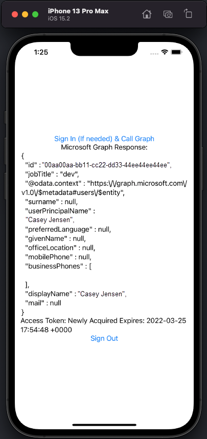

<!-- Keeping yaml frontmatter commented out for now
---
# Metadata required by https://docs.microsoft.com/samples/browse/
# Metadata properties: https://review.docs.microsoft.com/help/contribute/samples/process/onboarding?branch=main#add-metadata-to-readme
languages:
- swift 
page_type: sample
name: "SwiftUI Multiplatform app that makes a request to the Graph API after signing in the user"
description: "This Swift 5.5 Multiplatform SwiftUI iOS and macOS app signs in the user and then makes a request to Microsoft Graph for the user's profile data."
products:
- azure
- azure-active-directory
- ms-graph
urlFragment: ms-identity-docs-code-app-swift-multiplatform
---
-->

# Swift | Multiplatform SwiftUI iOS and macOS | user sign-in, protected web API access (Microsoft Graph) | Microsoft identity platform

<!-- Build badges here
  
-->

This Swift 5.5 Multiplatform SwiftUI iOS and macOS app authenticates a user and then makes a request to the Graph API as the authenticated user. The response to the request is presented to the user.




## Prerequisites

- Azure Active Directory (Azure AD) tenant and the permissions or role required for managing app registrations in the tenant.
- Xcode 13.2.1
- Swift 5.5

## Setup

### 1. Register the app

First, complete the steps in [Register an application with the Microsoft identity platform](https://docs.microsoft.com/en-us/azure/active-directory/develop/tutorial-v2-ios#register-your-application) to register the application.

Use these settings in your app registration.

| App registration <br/> setting  | Value for this sample app                                           | Notes                                                                           |
|--------------------------------:|:--------------------------------------------------------------------|:--------------------------------------------------------------------------------|
| **Name**                        | `active-directory-swift-ios-macos-authorization-code-grant-flow`    | Suggested value for this sample. <br/> You can change the app name at any time. |
| **Supported account types**     | **Accounts in this organizational directory only (Single tenant)**  | Suggested value for this sample.                                                |
| **Platform type**               | **iOS / macOS **                                                    | Required value for this sample                                                  |
| **Redirect URIs**               | `msauth.com.contoso.msalExample-macOS://auth` and `msauth.com.contoso.msalExample-iOS://auth` | Required value for this sample                    |

> :information_source: **Bold text** in the tables above matches (or is similar to) a UI element in the Azure portal, while `code formatting` indicates a value you enter into a text box in the Azure portal.

### 2. Open the project in Xcode 

Next, open the _msalexamples-ios-macos.xcodeproj_ project in Xcode.

### 3. Update code sample in MSALAuthentication.swift_ with app registration values

Finally, set the following values in _Shared/MSALAuthentication.swift_.

```csharp
// 'Application (client) ID' of app registration in Azure portal - this value is a GUID
private static let kClientId = ""

// 'Tenant ID' of your Azure AD instance - this value is a GUID
private static let kTenantId = ""
```

## Run the application

iOS

Select any iOS simulator and then press :arrow_forward: 

macOS

Select My Mac and then press :arrow_forward: 

The appliction will open allowing you to click the **Sign In** button to use the authentication flow.


## About the code

This Swift 5.5 Multiplatform iOS and macOS app presents a button that initiates an authentication flow using the Microsoft Authentication Library for iOS and macOS (MSAL). The user completes this flow in their default web browser or natively in iOS. Upon successful authentication, an HTTP GET request to the Microsoft Graph /me endpoint is issued with the user's access token in the HTTP header. The response from the GET request is then displayed to the user.

This project use Swift Package Manager dependencies to reference `MSAL` from [AzureAD/microsoft-authentication-library-for-objc](https://github.com/AzureAD/microsoft-authentication-library-for-objc). For more information, please refer to using [Swift Packages](https://github.com/AzureAD/microsoft-authentication-library-for-objc/tree/3bc25ad3c38c0f0044e3fc624a841ac4789478c0#using-swift-packages)

## Reporting problems

### Sample app not working?

If you can't get the sample working, you've checked [Stack Overflow](http://stackoverflow.com/questions/tagged/msal), and you've already searched the issues in this sample's repository, open an issue report the problem.

1. Search the [GitHub issues](/issues) in the repository - your problem might already have been reported or have an answer.
1. Nothing similar? [Open an issue](/issues/new) that clearly explains the problem you're having running the sample app.

### All other issues

> :warning: WARNING: Any issue in this repository _not_ limited to running one of its sample apps will be closed without being addressed.

For all other requests, see [Support and help options for developers | Microsoft identity platform](https://docs.microsoft.com/azure/active-directory/develop/developer-support-help-options).

## Contributing

If you'd like to contribute to this sample, see [CONTRIBUTING.MD](/CONTRIBUTING.md).

This project has adopted the [Microsoft Open Source Code of Conduct](https://opensource.microsoft.com/codeofconduct/). For more information, see the [Code of Conduct FAQ](https://opensource.microsoft.com/codeofconduct/faq/) or contact [opencode@microsoft.com](mailto:opencode@microsoft.com) with any additional questions or comments.
